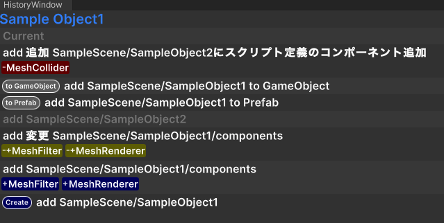

# unity-history-viewer
現在開発中

## features
### git log結果をGameObject単位に表示


## Install
以下URIを`unity package manager` -> `Add package from git URL...` から追加

```https://github.com/negi0109/unity-history-viewer.git#release```

### 過去バージョン
https://github.com/negi0109/unity-history-viewer/releases
